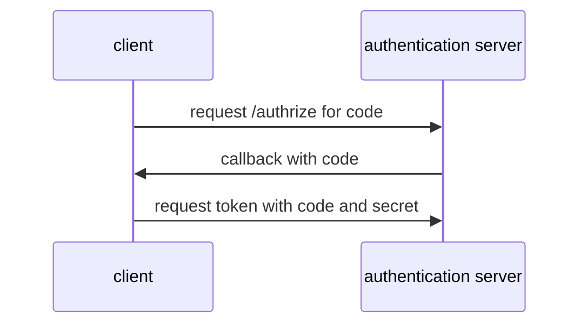

# you know: for test

## YuFu 鉴权流程

```mermaid
sequenceDiagram
    participant a as client
    participant b as authentication server
    a->>b: request /authrize for code
    b->>a: callback with code
    a->>b: request token with code and secret
```
